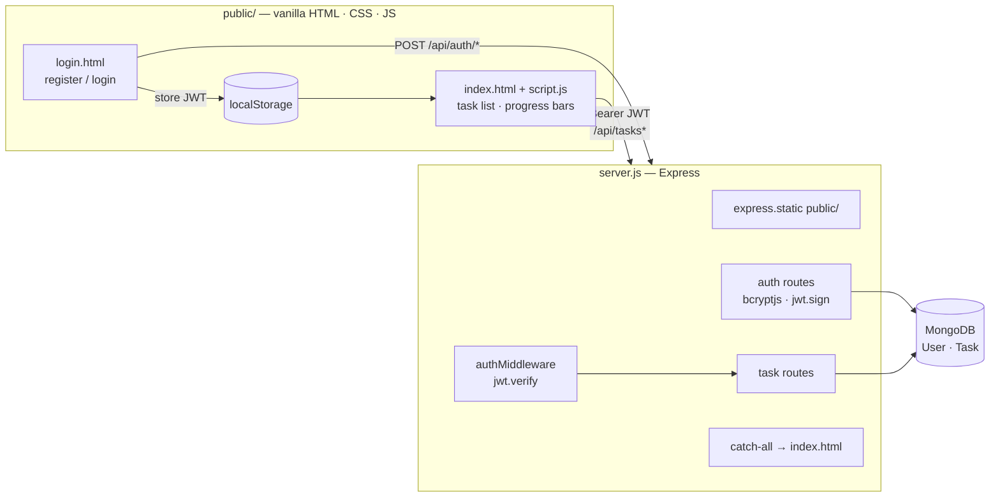

# Task Manager

**A counter-based task tracker. Each task has a target count, such as "Solve 30 DSA problems" or "Read 10 chapters", and you click to increment progress until it's done.**

It is a single Express server that serves a vanilla-JS frontend and a JWT-protected REST API backed by MongoDB. Each user sees only their own tasks.

---

## Features

- Register and log in with a username and password (bcryptjs hashing, JWT auth)
- Create tasks with a **total count** and track `currentCount` against it using a progress bar
- **Increment** progress with one click. A task is marked `completed` automatically when it reaches the target.
- Edit and delete tasks
- Per-user isolation: every task is scoped to `userId` from the JWT

## Architecture



### Data model

| Model | Fields |
|---|---|
| `User` | `username` (unique), `password` (hashed), timestamps |
| `Task` | `userId` → User, `text`, `totalCount`, `currentCount` (default 0), `completed`, timestamps |

### API

| Method | Path | Auth | Description |
|---|---|---|---|
| `POST` | `/api/auth/register` | — | Create an account |
| `POST` | `/api/auth/login` | — | Returns a JWT |
| `GET` | `/api/tasks` | ✔ | List my tasks |
| `POST` | `/api/tasks` | ✔ | Create a task `{ text, totalCount }` |
| `PUT` | `/api/tasks/:id` | ✔ | Update a task |
| `PUT` | `/api/tasks/:id/increment` | ✔ | +1 progress, auto-completes at the target |
| `DELETE` | `/api/tasks/:id` | ✔ | Delete a task |

## Getting started

```bash
git clone https://github.com/nakultt/Task-manager.git
cd Task-manager
npm install
cat > .env <<EOF2
MONGO_URI=mongodb://localhost:27017/taskmanager
JWT_SECRET=change-me
PORT=3000
EOF2
node server.js     # http://localhost:3000
```

## Tech stack

Node.js · Express · MongoDB / Mongoose · bcryptjs · jsonwebtoken · CORS · dotenv · HTML/CSS/JavaScript
